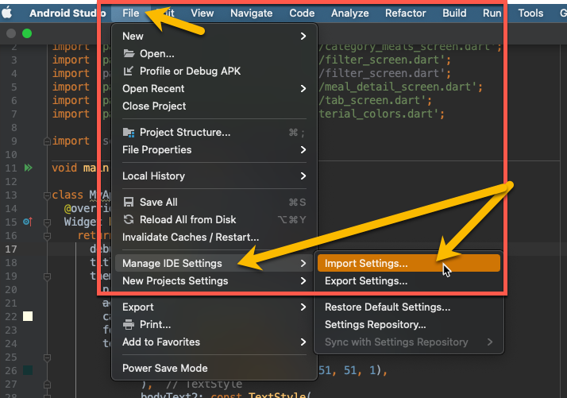
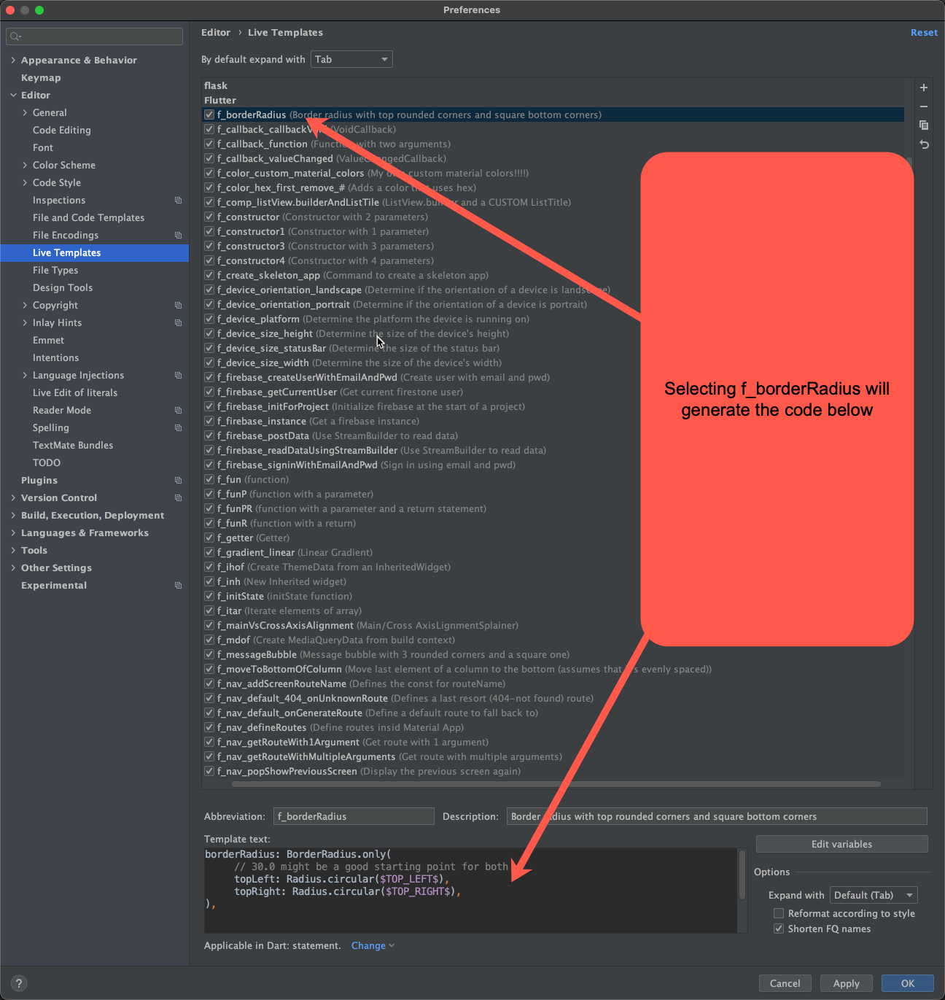
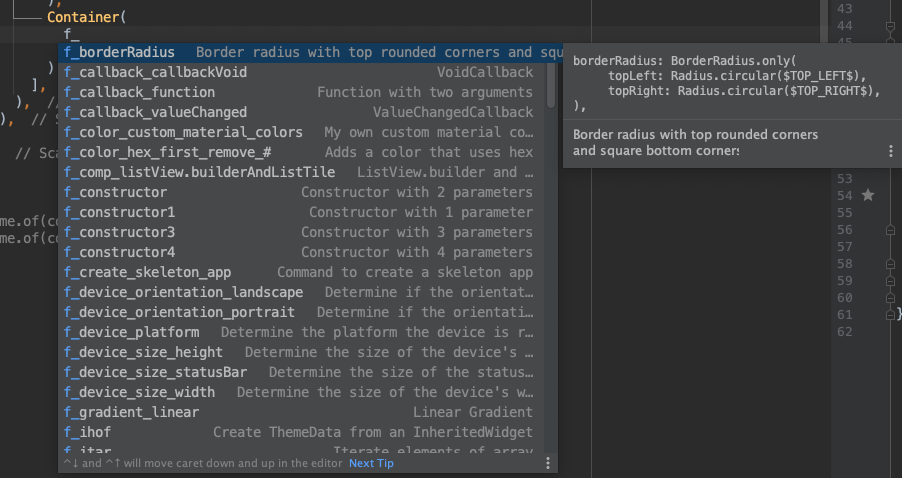
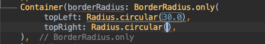
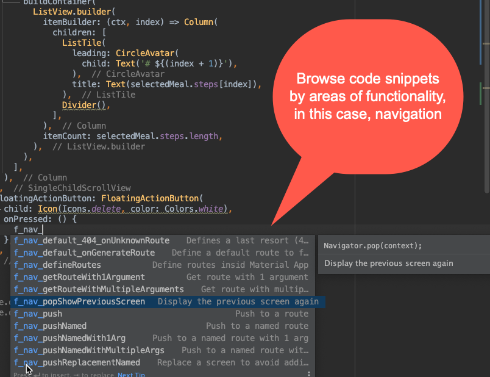

# This is a huge collection of live templates that includes tips, examples, prod-ready code to speed up Flutter (and Dart) development.
# Currently, there are around 270 live templates for Flutter (220) and Dart (more than 50).
## How to import the templates

## Live Templates overview

## How to use them

## Generated code

## Browse by functionality

